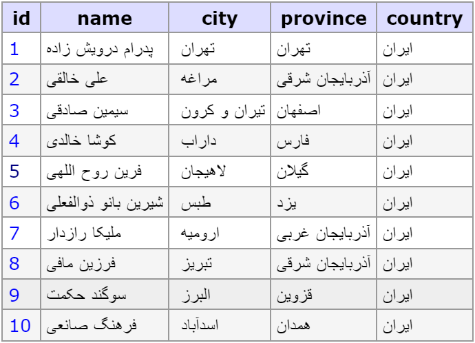

# پروژه پایگاه داده

نام و نام خانوادگی : میلاد رضوانی

شماره دانشجویی : 1400442120

پایگاه داده نوشته شده در مورد یک شرکت اجاره دادن اسکوتر های برقی است ، که برای حمل و نقل آسان تر و سریع تر از خودرو ها می باشد و رد پای کربن کمتری دارد امروزه معمولا در کشور های غربی مورد استفاده قرار می گیرند و در واقع جای دوچرخه هایی را می گیرند که در شهر های مختلف ایران نیز مورد استفاده قرار می گرفتند ولی به علت کند بودن و صرف انرژی زیاد نتوانستند جای خود را در بین مردم پیدا کنند بنابراین هدف این است تا با استفاده از اسکوتر ها نه تنها از وجود ترافیک و آلایندگی ها راحت شویم بلکه روشی آسان تر برای حمل و نقل افراد با هزینه ای مناسب را برای انسان ها به ارمغان آوریم.


---

## چند پرسمان بر روی جدول ها

پرسمان زیر را در نظر بگیرید که مقدار اسکوتر های موجود در هر شهر را برای ما به دست می آورد

```sql
SELECT COUNT(S.id) AS quantity, city_id, C.name FROM scooter AS S
INNER JOIN cities AS C ON S.city_id = C.id
GROUP BY S.city_id;
```

برای این منظور دو جدول شهرها را با جدول اسکوتر ها پیوند می دهیم تا بتوانیم در کنار city_id اسم شهر ها را هم داشته باشیم


در این پرسمان می خواهیم ببینیم هر یک از کاربر ها از کدام شهر ،استان و کشور زندگی می کنند که هر یک از جداول کاربر، ادرس، شهر، استان و کشور را با هم join می دهیم

```sql
SELECT U.id , CONCAT( first_name, " ", last_name) AS name, C.name AS city,P.name AS province,K.name AS country
FROM users AS U
INNER JOIN address AS A ON U.id = A.user_id
INNER JOIN cities AS C ON A.city_id = C.id
INNER JOIN provinces AS P ON  P.id = C.province
INNER JOIN countries AS K ON k.id = P.country;
```




با استفاده از پرسمان زیر می توانیم اسکوتر های که خراب شده و غیر قابل تعمیر هستند را پیدا کنیم

```sql
SELECT delivered_item_id,delivered_location_id FROM return_and_upkeep WHERE item_condition = "irreparable";
```


با پرسمان زیر میتوانی تعداد کاربرانی را پیدا کنیم که در تاریخ های مشخص اسکوتر اجاره کرده اند

```sql
SELECT U.id, U.first_name, U.last_name, S.id, S.name, R.contract_start_date, R.contract_end_date
FROM rent_detail AS R
INNER JOIN users AS U ON U.id = R.customer_id
INNER JOIN scooter AS S ON S.id = R.rented_item_id
WHERE contract_start_date BETWEEN "2023-03-20" AND "2023-06-20";
```


این پرسمان نیز همانند بالا است ولی تعداد کاربرانی را به دست می آوریم که در در طی یک تاریخ بیش از 5 اسکوتر اجاره کرده اند

```sql
SELECT U.id, U.first_name, U.last_name, S.id, S.name, R.contract_start_date, R.contract_end_date
FROM rent_detail AS R
INNER JOIN users AS U ON U.id = R.customer_id
INNER JOIN scooter AS S ON S.id = R.rented_item_id
GROUP BY R.customer_id
HAVING COUNT(R.customer_id) > 5 AND contract_start_date BETWEEN "2023-02-20" AND "2023-07-20";
```


---

## جدول های مورد نیاز

قبل از شروع ساخت جداول باید پایگاه داده خود را بسازیم و نامی را برای آن انتخاب کنیم

```sql
CREATE DATABASE `scooter`;
```

اولین و اساسی ترین جدول ما را جدول users تشکیل می دهد
.

```sql
CREATE TABLE `users` (
  `id` int(11) NOT NULL AUTO_INCREMENT,
  `first_name` varchar(255) CHARACTER SET utf8 COLLATE utf8_persian_ci NOT NULL,
  `last_name` varchar(255) CHARACTER SET utf8 COLLATE utf8_persian_ci NOT NULL,
  `phone` varchar(20) DEFAULT NULL,
  `email` varchar(255) NOT NULL,
  `password` varchar(255) NOT NULL,
  `national_id` varchar(255) NOT NULL,
  `wallet_balance` varchar(255) NOT NULL DEFAULT '0',
  `created_at` datetime DEFAULT CURRENT_TIMESTAMP,
  `updated_at` datetime DEFAULT CURRENT_TIMESTAMP,
  PRIMARY KEY (`id`)
);
```

با استفاده از created_at از زمان ساخت اکانت و updated_at از زمان بروز رسانی اطلاعات کاربر توسط خودش مطلع میشویم

از email و password بعدا برای ورود مجدد کاربر به برنامه خود استفاده خواهیم کرد

همچنین برای هر کشور ، استان و شهر یک جدول جداگانه در نظر گرفتیم که با توجه به city_id موجود در address کشور و استان کاربر را پیدا کرد یا از تعداد اسکوتر های موجود در شهر ها را بررسی کرد.

جدول مربوط به جدا کردن کشور ها

```sql
CREATE TABLE `countries` (
  `id` int(11) NOT NULL AUTO_INCREMENT,
  `capital_city` int(11) DEFAULT NULL,
  `name` varchar(64) CHARACTER SET utf8mb4 COLLATE utf8mb4_persian_ci NOT NULL,
  PRIMARY KEY (`id`)
);
```

جدول مربوط به استان ها

```sql
CREATE TABLE `provinces` (
  `id` int(11) NOT NULL AUTO_INCREMENT,
  `country` int(11) DEFAULT NULL,
  `name` varchar(64) CHARACTER SET utf8 COLLATE utf8_persian_ci NOT NULL,
  PRIMARY KEY (`id`),
  FOREIGN KEY (`country`) REFERENCES `countries` (`id`)
);
```

جدول مربوط به شهر های موجود در استان ها ، که province کلید خارجی بوده و به جدول provinces با استفاده از id موجود اشاره میکند

```sql
CREATE TABLE `cities` (
  `id` int(11) NOT NULL AUTO_INCREMENT,
  `province` int(11) DEFAULT NULL,
  `name` varchar(64) CHARACTER SET utf8 COLLATE utf8_persian_ci NOT NULL,
  PRIMARY KEY (`id`),
  FOREIGN KEY (`province`) REFERENCES `provinces` (`id`)
);
```

جدول بعدی ما address خواهد بود تا اطلاعات محل زندگی کاربر را داشته باشیم.

```sql
CREATE TABLE `address` (
  `id` int(11) NOT NULL AUTO_INCREMENT,
  `user_id` int(11) NOT NULL,
  `city_id` int(11) NOT NULL,
  `street` varchar(255) CHARACTER SET utf8 COLLATE utf8_persian_ci DEFAULT NULL,
  `zipcode` varchar(255) NOT NULL,
  `house_phone_number` varchar(20) NOT NULL,
  PRIMARY KEY (`id`),
  FOREIGN KEY (`user_id`) REFERENCES `users` (`id`),
  FOREIGN KEY (`city_id`) REFERENCES `cities` (`id`)
);
```

برای اجاره اسکوتر ها کاربر لازم است تا مقدار پولی را به کیف پول موجود در اپلیکیشن، پرداخت کرده و سپس با استفاده از آن خرید های خود را انجام دهد
مقدار موجودی کاربر در جدول users با اسم (wallet_balance) ذخیره می کنیم ولی در جدول wallet تراکنش های رخ داده را
ثبت می نماییم

```sql
CREATE TABLE `wallet` (
  `id` int(11) NOT NULL AUTO_INCREMENT,
  `user_id` int(11) NOT NULL,
  `amount` varchar(255) NOT NULL,
  `type` enum('withdrawal','deposit') NOT NULL,
  `date` datetime DEFAULT CURRENT_TIMESTAMP,
  PRIMARY KEY (`id`),
  FOREIGN KEY (`user_id`) REFERENCES `users` (`id`)
);
```

برای بروز رسانی (wallet_balance) ما از یک TRIGGER استفاده می کنیم تا هر گاه نوع آن واریز باشد با مقدار موجودی جمع می کنیم و هر گاه مفداری برداشت شود آن را از موجودی کسر می کنیم

```sql
DELIMITER ;;

CREATE TRIGGER `wallet_ai` AFTER INSERT ON `wallet` FOR EACH ROW
begin
if NEW.type = "deposit" THEN
update users SET wallet_balance = wallet_balance + NEW.amount where id = NEW.user_id;
ELSEIF NEW.type = "withdrawal" THEN
update users SET wallet_balance = wallet_balance - NEW.amount where id = NEW.user_id;
end if;
end;;

DELIMITER ;
```

جدول اسکوتر ها شامل همه اطلاعات لازم در مورد اسکوتر های برقی خواهد بود تا هر کاربری با توجه به ویژگی های مورد
نیاز، انتخاب خود را انجام دهد
همچنین در مورد داشتن city_id هم برای مشخص کردن تعداد موجودی آن نوع اسکوتر در آن شهر خواهد بود

```sql
CREATE TABLE `scooter` (
  `id` int(11) NOT NULL AUTO_INCREMENT,
  `city_id` int(11) NOT NULL,
  `name` varchar(255) DEFAULT NULL,
  `rent_price` float DEFAULT NULL,
  `top_speed` float DEFAULT NULL,
  `Weight` float DEFAULT NULL,
  `battery_capacity` int(11) DEFAULT NULL,
  `battery_recharge_time` int(11) DEFAULT NULL,
  `range` int(11) DEFAULT NULL,
  `rider_weight_limit` float DEFAULT NULL,
  `water_resistance` enum('Unknown','IPX4','IPX5','IPX6','IPX7') DEFAULT NULL,
  `acceleration` float DEFAULT NULL,
  `brake_type` enum('Regenerative + Disc','Disc') DEFAULT NULL,
  PRIMARY KEY (`id`),
  FOREIGN KEY (`city_id`) REFERENCES `cities` (`id`)
);
```

جدول، جزئیات اجاره را شامل می شود که کدام کاربر کدام اسکوتر را در چه زمانی شفارش کرده و زمان پایان قرار داد اجاره تا چه زمانی خواهد بود
همچنین آیا کاربر اجاره را لغو کرده یا همچنان پابرجا است

```sql
CREATE TABLE `rent_detail` (
  `id` int(11) NOT NULL AUTO_INCREMENT,
  `customer_id` int(11) NOT NULL,
  `rented_item_id` int(11) NOT NULL,
  `contract_start_date` datetime NOT NULL DEFAULT CURRENT_TIMESTAMP,
  `contract_end_date` datetime NOT NULL DEFAULT CURRENT_TIMESTAMP,
  `cancelled_order` tinyint(1) NOT NULL,
  PRIMARY KEY (`id`),
  FOREIGN KEY (`rented_item_id`) REFERENCES `scooter` (`id`),
  FOREIGN KEY (`customer_id`) REFERENCES `users` (`id`)
);
```

جدول اسکوتر لوکیشن در واقع اطلاعاتی است که بعد از اجاره اسکوتر در اختیار کاربر قرار گرفته و محلی که قرار است اسکوتر خود را از آنجا بردارد را مشخص می کند contract_id کلید خارجی بوده و به کلید اصلی جدول rent_detail مربوط می شود و city_id هم به جدول cities

```sql
CREATE TABLE `scooter_location` (
  `id` int(11) NOT NULL AUTO_INCREMENT,
  `contract_id` int(11) NOT NULL,
  `city_id` int(11) NOT NULL,
  `street` varchar(255) CHARACTER SET utf8 COLLATE utf8_persian_ci DEFAULT NULL,
  `latitude` decimal(10,8) NOT NULL,
  `longitude` decimal(10,8) NOT NULL,
  `password_to_unlock` varchar(255) NOT NULL,
  PRIMARY KEY (`id`),
  FOREIGN KEY (`contract_id`) REFERENCES `rent_detail` (`id`),
  FOREIGN KEY (`city_id`) REFERENCES `cities` (`id`)
);
```

از latitude و longitude برای موقعیت جغرافیای و برای نشان دادن موقعیت اسکوتر در نقشه استفاده می شود
برای کاربر یک پسورد به صورت رندوم تولید می کنیم تا قابلیت های اسکوتر فقط برای او قابل استفاده باشد

هر اسکوتر بعد از اینکه توسط کاربر دریافت می شوند وضعیت آن ها چک شده ودر صورت سالم بودن دوباره در اختیار کاربران قرار می گیرند

```sql
CREATE TABLE `return_and_upkeep` (
  `id` int(11) NOT NULL AUTO_INCREMENT,
  `delivered_location_id` int(11) NOT NULL,
  `delivered_item_id` int(11) NOT NULL,
  `item_returned_date` datetime DEFAULT CURRENT_TIMESTAMP,
  `item_condition` enum('irreparable','repairable') DEFAULT NULL,
  PRIMARY KEY (`id`),
  FOREIGN KEY (`delivered_location_id`) REFERENCES `scooter_location` (`id`),
  FOREIGN KEY (`delivered_item_id`) REFERENCES `scooter` (`id`)
);
```
